# User Manual

- [User Manual](#user-manual)
  - [Main view](#main-view)
    - [Main Search](#main-search)
  - [Import](#import)
    - [1. Import file path](#1-import-file-path)
    - [2. Import Type](#2-import-type)
    - [3. Action](#3-action)
    - [Action **Controll**](#action-controll)
    - [Action **Import**](#action-import)
  - [Export](#export)
  - [Company](#company)
  - [Distributor](#distributor)
    - [Add](#add)
  - [Edit](#edit)
  - [Delete](#delete)
  - [Settings](#settings)
  - [About](#about)
  - [Exit](#exit)

---

## Main view

Lanciato il programma viene mostrata la seguente finestra:

> 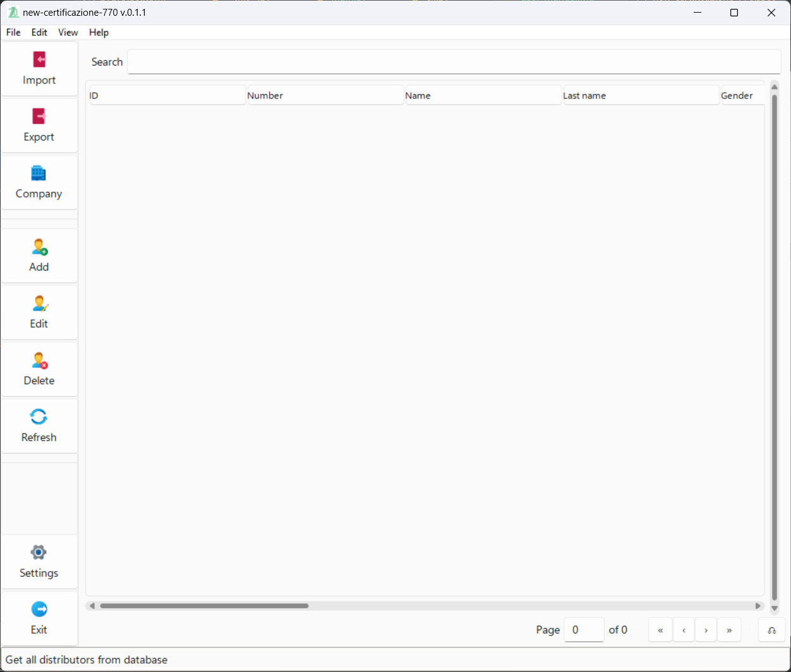

La finestra si compone di 3 parti principali:

1. La parte sinistra con i pulsanti di azione:
   > 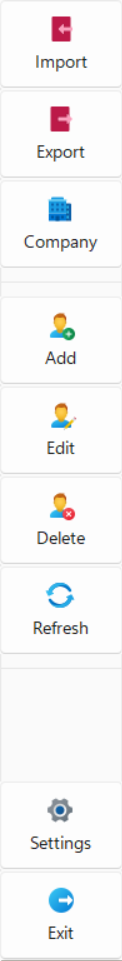

2. La parte centrale a destra con:
    - la textbox di ricerca in alto
    - la lista dei Distributori al centro
    - la barra della paginazione in basso

   > 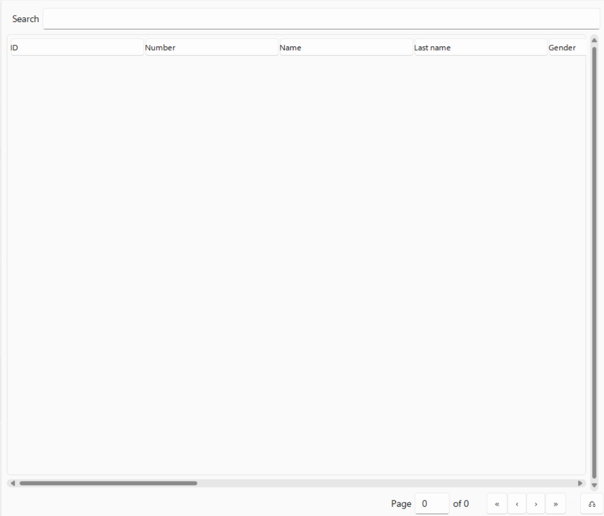

3. La parte in basso con la status bar per le informazioni:
   > 

Se il database è vuoto NON sarà mostrato nessun record. Per inserire record nel DB utilizzare la funzionalità [Import](#import) oppure aggiungere un distrubutore con il pulsante [Add](#add)

Dopo l'aggiunta dei record la vista si popolerà con i dati:

>  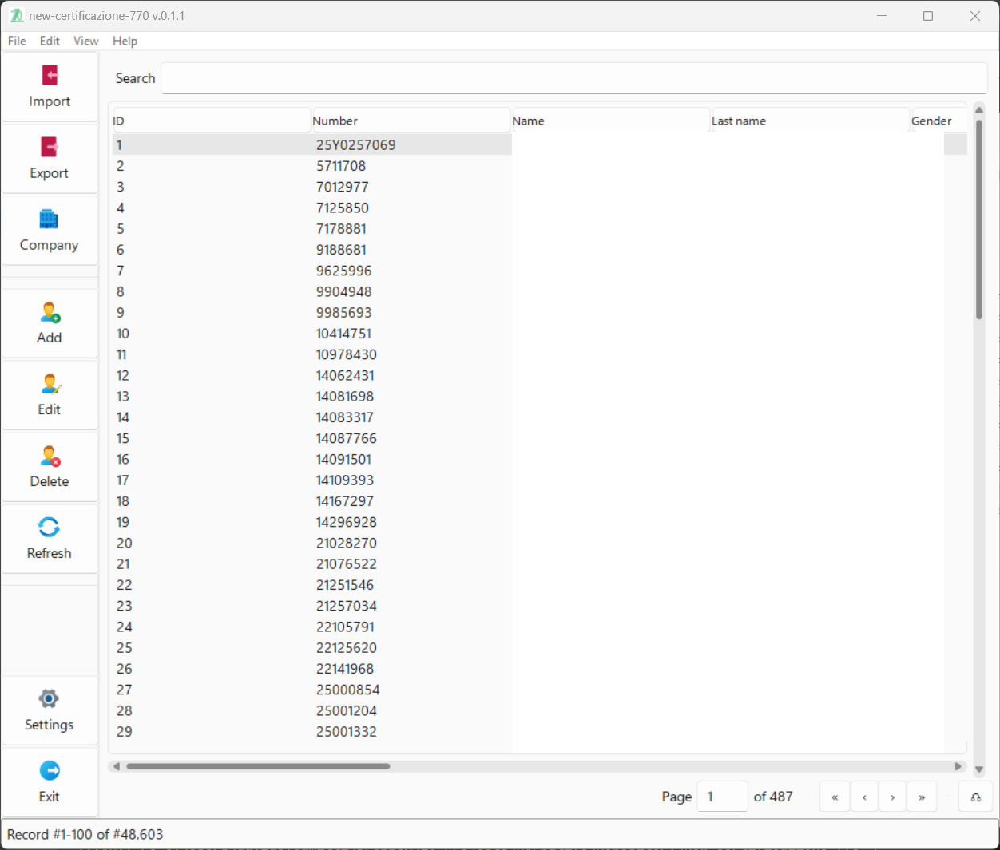

Saranno popolati anche la barra della paginazione

### Main Search

Per ricercare un valore nei record presenti in base dati immettere il valore (Esempio _`Milano`_) nella buca di ricerca (vedi esempio in giallo nell'immagine sotto):

> 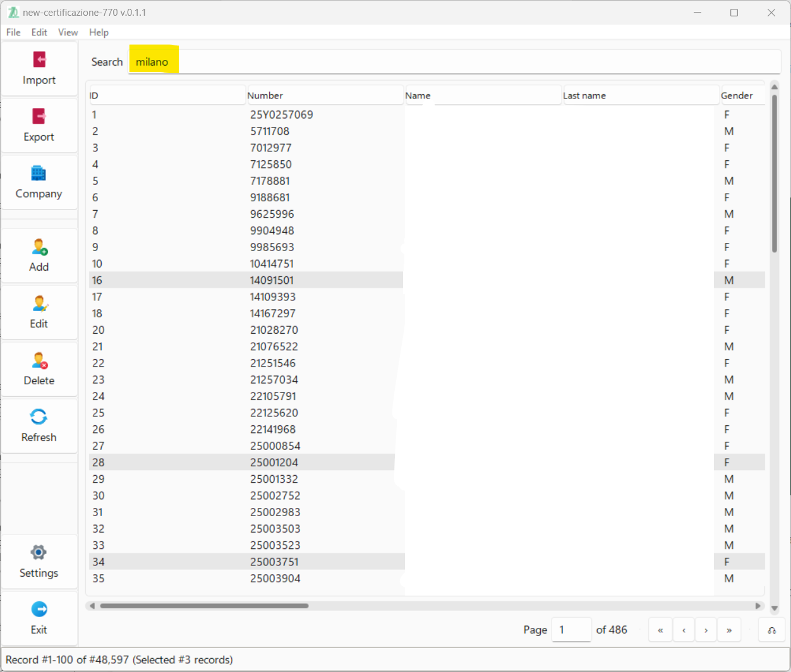

Cliccando su `Enter` verranno selezionati e visionati tutti i record con la stringa di ricerca `Milano` nei campi di testo

> 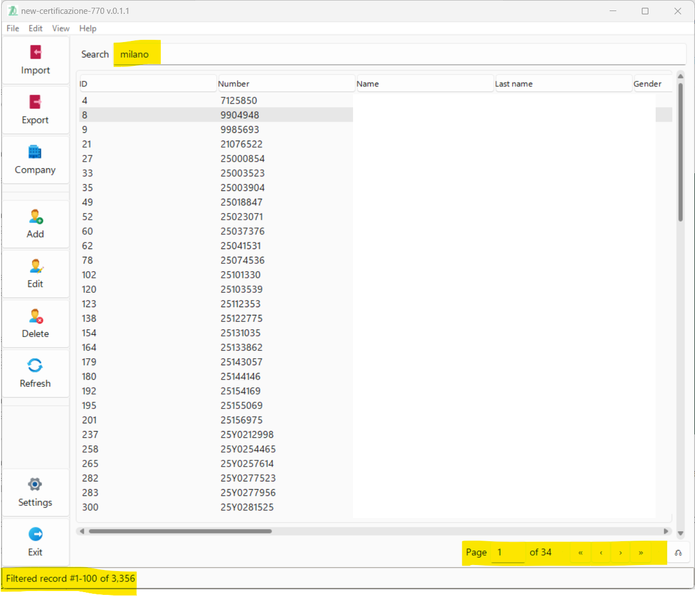

Inoltre verranno mostrati i numeri dei risultati nella barra di stato e verrà modificata la barra di paginazione.

Per ritornare alla situazione precedente premere il pulsante **`Refresh`** nella barra dei pulsanti o il pulsante **`⟲`** della barra di paginazione.

> 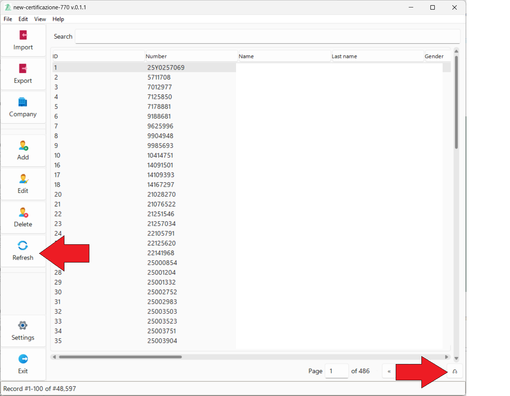

---

## Import

Cliccando sul pulsante **`Import`** oppure nel menu _`File > Import`_  si accede alla finestra per importare i file Anagrafica Distributori e/o Fatture in formato Excel.

> 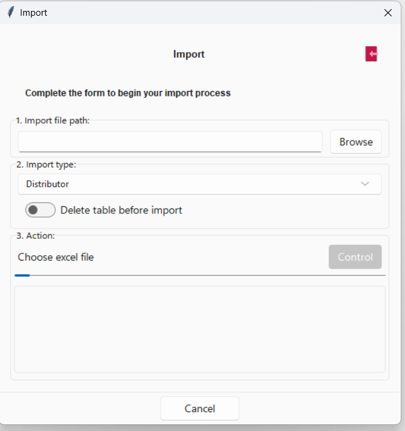

La finestra si compone di 3 parti e relativi step:

### 1. Import file path

Qui si sceglie il file da importare attraverso il pulsante **`Browse`**. 

Scelto il file si attiva il pulsante **`Control`** per far partire il processo di analisi del file in input. Nella parte in basso ci saranno inseriti record con le informazioni dei processi, del loro status e degli eventuali sottoprocessi

  > 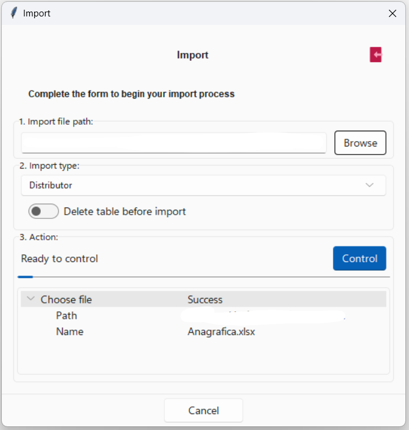

Se si preme il pulsante **`Browse`** si ricomincia il processo.

### 2. Import Type

In questa sezione possono essere scetli:

- La tipologia di importazione: _Distributor_ o _Invoice_ a seconda si voglia importare un file con Anagrafica Distributori o Fatture
- Un check per scegliere se cancellare totalmente la tabella (_Distributor_ o _Invoice_).
    > **ATTENZIONE**  
    > La scelta potrà essere variata anche in una fase successiva

### 3. Action

In questa sezione sono elencati:

1. l'azione principale eseguita dal processo
2. una barra con l'avanzamento del processo
3. il pulsante per l'azione successiva del processo **`Control`** o ****`Import`**
4. una vista dei processi e sotto-processi con relativo status

A seconda del processo, dello status e dei risultati tutti i cambi varieranno

### Action **Controll**

Dopo che si è scelto il file, il tipo di Import e si preme il pulsante **`Control`** il pulsante stesso si disabilita e parte un processo evidenzato dal messaggio e dalla barra progressiva che si attiva:

> 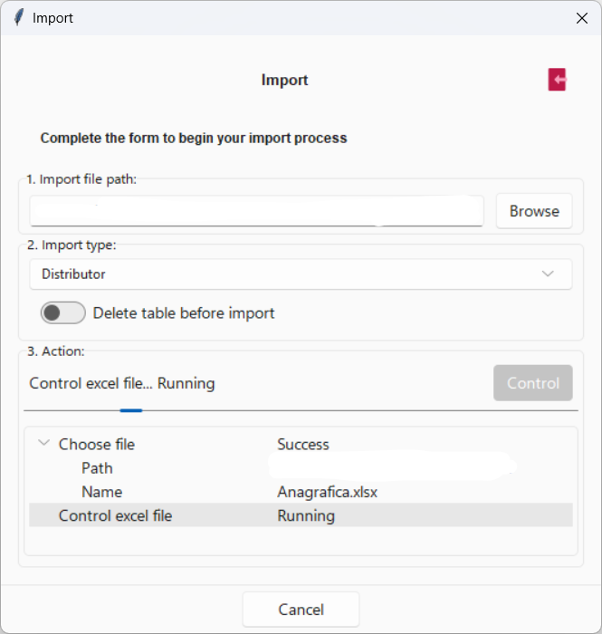

Alla fine del processo verranno mostrati:

 - In caso di successo una finestra con il numero di record letti nel file excel
    > 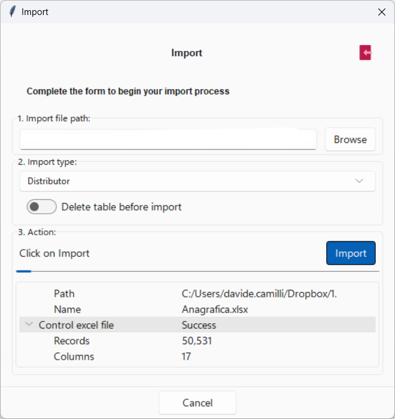
- In caso di errore un messaggio 
    > 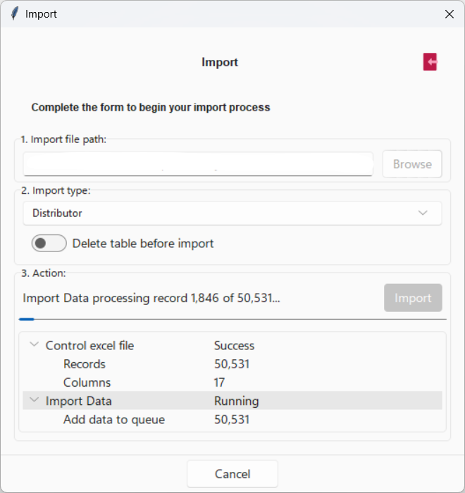

### Action **Import**
Dopo che è terminato con successo il processo di [Controllo](#action-controll) il pulsante cambia testo e si trasforma in **`Import`**

## Export

## Company

> 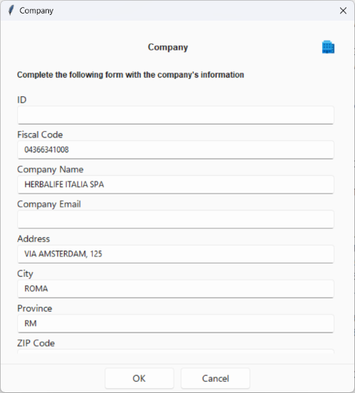

> 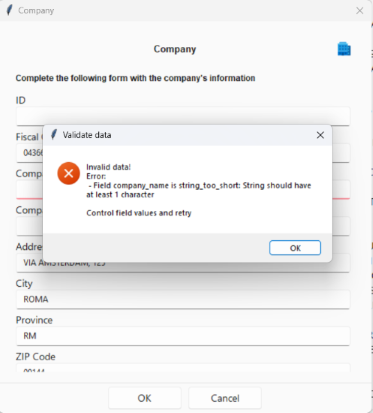

## Distributor

### Add

## Edit

## Delete

## Settings

## About

Attarverso il menu _`Help > About`_ si apre la finestra delle informazioni sul programma:

> 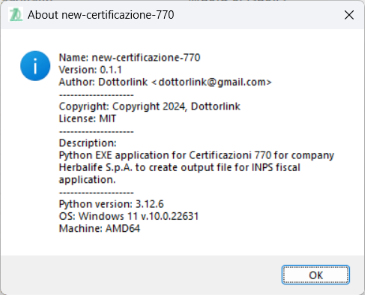

## Exit